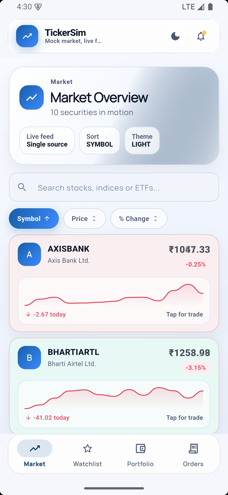
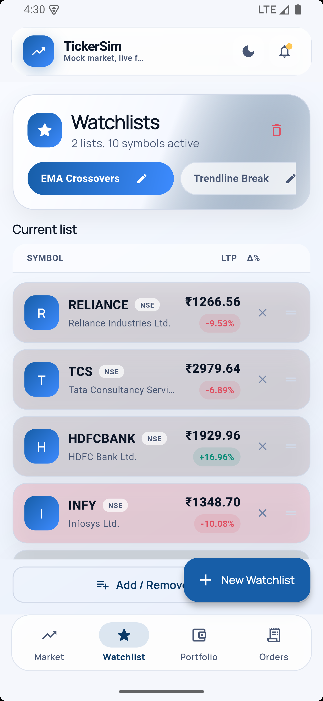
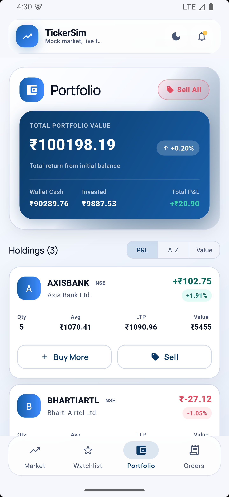
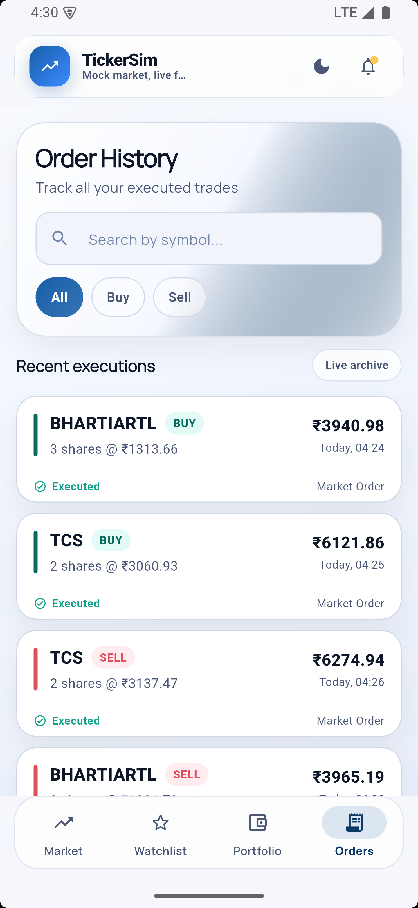
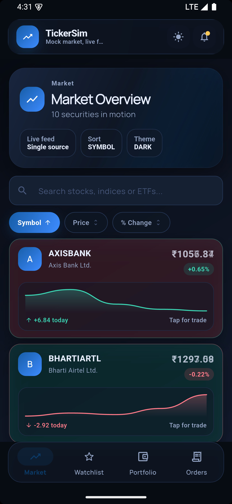
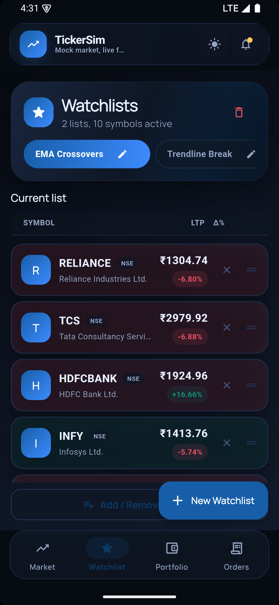
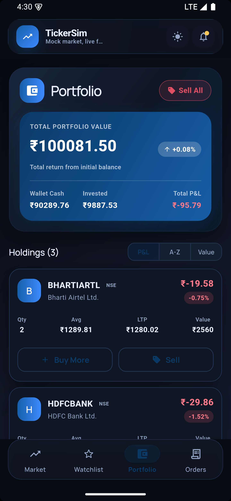
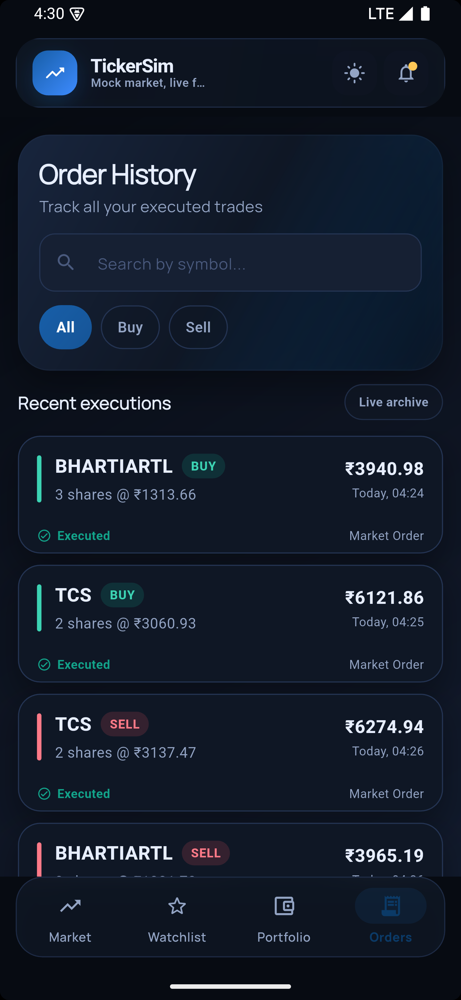

# Trading App

A lightweight, multi‑screen Flutter application that showcases real‑time market data, watchlists, portfolio management, and order handling. The project demonstrates a modern **Riverpod + StateNotifier** architecture (MVVM‑style) with clean‑separation of UI, state, and domain layers, making it a solid reference for production‑grade Flutter codebases.

---

## Table of Contents

1. [Features](#features)
2. [Architecture Overview](#architecture-overview)
3. [Folder Structure](#folder-structure)
4. [Why We Chose This Architecture](#why-we-chose-this-architecture)
5. [Getting Started](#getting-started)
6. [Running the App](#running-the-app)
7. [Testing & Linting](#testing--linting)
8. [Contribution Guidelines](#contribution-guidelines)
9. [License](#license)

---

## Features

24: - **Live Market Feed** – Real‑time price ticks with animated flash on price change.
- **Watchlist** – Add, remove, reorder symbols; persistent across app restarts.

---

## App Flow & Screens

### Video Overview
[Watch demo video](./assets/AppFlow.mp4)

### Light Mode Screens

| Market | Watchlist | Portfolio | Order History |
|--------|-----------|----------|---------------|
|  |  |  |  |

### Dark Mode Screens

| Market | Watchlist | Portfolio | Order History |
|--------|-----------|----------|---------------|
|  |  |  |  |

- **Watchlist** – Add, remove, reorder symbols; persistent across app restarts.
- **Portfolio** – View holdings, P&L, and bulk‑sell operation.
- **Orders** – History view with searchable and filterable list.
- **Trade Bottom Sheet** – Quick buy/sell UI with custom validation.
- **Dark/Light Theme** – Theming handled via Riverpod‑based `ThemeAgent`.
- **Responsive Layout** – Works on phones and tablets (adaptive UI).

---

## Architecture Overview

| Layer | Responsibility | Implementation |
|-------|----------------|----------------|
| **Presentation** | Widgets, UI layout, animations | `ConsumerWidget` / `ConsumerStatefulWidget` |
| **View‑Model** | Business logic, state manipulation | `StateNotifier` subclasses (e.g., `MarketScreenNotifier`) |
| **Domain / Core** | Data models, providers, constants | `core/models`, `core/providers`, `core/constants` |
| **Infrastructure** | External services (Firebase, API) – stubbed for demo | `firebase-mcp-server` (lazy) integration points |

We use **Riverpod** as a dependency‑injection & state‑management solution. Each screen has a corresponding `StateNotifier` that holds an immutable state object (`*_state.dart`). The UI merely watches these providers, achieving an **MVVM‑like** separation without the boilerplate of classic `ChangeNotifier`.

---

## Folder Structure

```
lib/
 ├─ core/
 │   ├─ agents/            # ThemeAgent – decides dark / light theme
 │   ├─ constants/         # Market constants, UI constants
 │   ├─ models/            # PriceTick, Order, Holding etc.
 │   ├─ providers/         # Riverpod providers (priceProvider, themeProvider…)
 │   └─ services/          # API stubs / firebase wrappers
 │
 ├─ features/
 │   ├─ market/
 │   │   ├─ screens/       # market_screen.dart
 │   │   └─ widgets/       # price_cell.dart, metric_pill.dart
 │   ├─ portfolio/
 │   │   ├─ screens/       # portfolio_screen.dart
 │   │   └─ widgets/       # holding_tile.dart
 │   ├─ orders/
 │   │   ├─ screens/       # orders_screen.dart
 │   │   └─ widgets/       # order_tile.dart
 │   ├─ watchlist/
 │   │   ├─ screens/       # watchlist_list_screen.dart
 │   │   └─ widgets/       # watchlist_row.dart
 │   └─ trade/
 │       └─ widgets/       # trade_bottom_sheet.dart
 │
 ├─ shared/
 │   └─ theme/             # app_theme.dart (MaterialTheme definitions)
 │
 ├─ main.dart              # App entry point, router, theme wiring
 └─ app.dart               # Optional – separates widget tree from main()
```

*Each feature folder contains its own UI, state (`*_state.dart`) and notifier (`*_notifier.dart`) – this modular layout makes it trivial to add/remove features.*

---

## Why We Chose This Architecture

1. **Scalability** – Adding a new feature only requires a new folder under `features/` with its own screen, state, and notifier. No cross‑feature coupling.
2. **Testability** – Business logic lives in `StateNotifier`s, which are pure Dart classes and can be unit‑tested without the widget tree.
3. **Readability for Teams** – Riverpod’s `ref.watch`/`ref.read` makes data flow explicit. New developers can locate “where the data comes from” by following the provider declarations.
4. **MVVM‑style Separation** – The UI (`View`) is unaware of *how* the state changes; it simply renders the immutable state supplied by the `ViewModel` (`StateNotifier`).
5. **Future‑Proof** – The core layer is deliberately thin; we can insert a clean‑architecture domain/use‑case layer later without touching UI code.
6. **Performance** – Only the widgets that depend on a changed piece of state rebuild, thanks to Riverpod’s fine‑grained listening.

---

## Getting Started

### Prerequisites

| Tool | Minimum Version |
|------|-----------------|
| **Flutter SDK** | `3.22.0` (or later) |
| **Dart** | `3.5.0` |
| **Android SDK / Xcode** | For device/emulator targets |
| **Git** | Any recent version |

> **Windows users:** Ensure the Flutter SDK `bin` directory is added to `PATH`.

### Clone the Repository

```bash
git clone https://github.com/your-company/trading_app.git
cd trading_app
```

### Install Dependencies

```bash
flutter pub get
```

### Setup Firebase (Optional – for real backend)

1. Create a Firebase project.
2. Download `google-services.json` (Android) & `GoogleService-Info.plist` (iOS).
3. Place them under `android/app/` and `ios/Runner/` respectively.
4. Run `flutterfire configure` (the repository includes a lazy MCP call `firebase_init` for automated setup if needed).

If you **don’t** need a backend, the app falls back to a local mock data source (`price_provider.dart` supplies random price ticks).

---

## Running the App

### On Android / iOS Emulator

```bash
flutter run
```

### On a Physical Device

```bash
flutter devices   # confirm the device is detected
flutter run -d <device-id>
```

### Web (optional)

```bash
flutter run -d chrome
```

> **Hot‑reload** works as usual (`r` in the console). The `PriceCell` widget demonstrates a custom `AnimationController`; hot‑reload preserves its state.

---

## Testing & Linting

The project follows `flutter analyze` strictness:

```bash
# Run static analysis
flutter analyze

# Run the unit / widget tests (currently a small suite)
flutter test
```

All lint warnings are fixed (unused imports, missing `const`, naming conventions). CI pipelines should block PRs with failing analysis.

---

## Contribution Guidelines

1. **Branching** – Create a new branch from `main` with a descriptive name (`feature/watchlist‑reorder`).
2. **Commit Style** – Use conventional commits (`feat:`, `fix:`, `chore:`).
3. **Code Style** – Run `flutter format .` before each commit.
4. **Testing** – Add unit tests for any new `StateNotifier` logic.
5. **Pull Request** – Include a short description, screenshots (if UI changes), and a reference to the related issue.
6. **Review** – At least one reviewer must approve before merging.

---

## License

This project is licensed under the **MIT License** – see the `LICENSE` file for details.

---

# Quick Start Cheat‑Sheet

```bash
# Clone, install, run
git clone https://github.com/your-company/trading_app.git
cd trading_app
flutter pub get
flutter run   # Android emulator defaults
```

**Key Commands**

| Command | Purpose |
|---------|---------|
| `flutter analyze` | Lint & static analysis |
| `flutter test` | Run unit / widget tests |
| `flutter format .` | Auto‑format code |
| `flutter pub run build_runner build` | (if code‑gen needed) |

---

Enjoy building, testing, and extending the Trading App!
